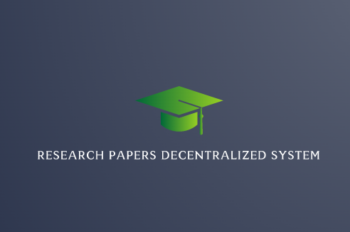
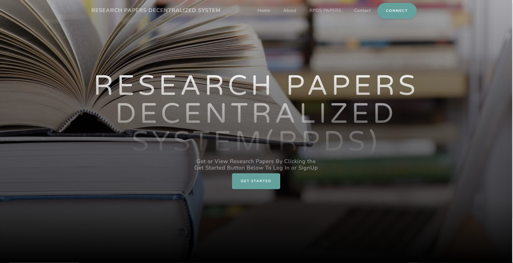
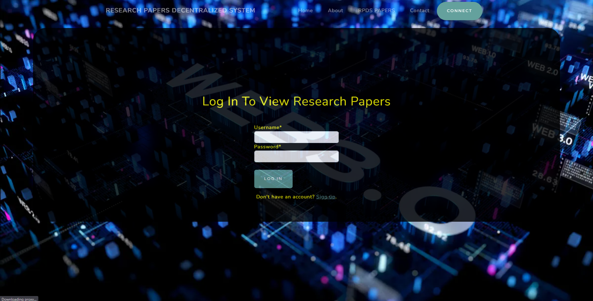
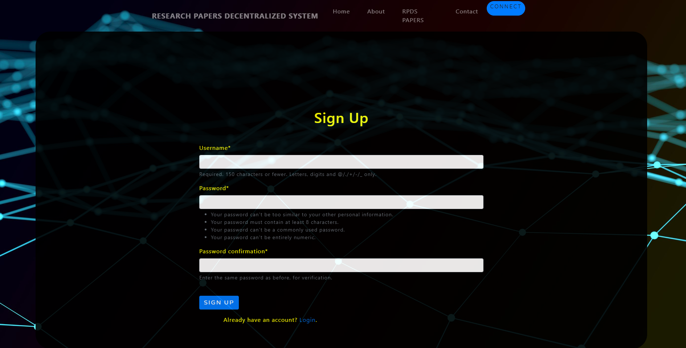
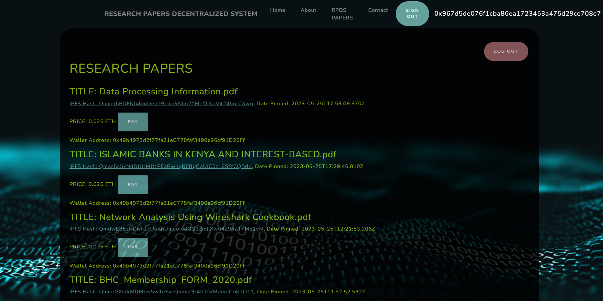

    

# RESEARCH PAPERS DECENTRALIZED SYSTEM
The Research Papers Decentralized System (RPDS) is a proposed blockchain platform
designed to revolutionize the way researchers access and share research papers. The platform
will be built on the Ethereum blockchain, which offers robust security and transparency
features.RPDS will be a decentralized platform, meaning that it will not be controlled by any
single entity or authority. Instead, the platform will be maintained by a network of nodes,
with each node contributing to the security and integrity of the platform.
The primary purpose of RPDS is to provide researchers with a more efficient and cost-
effective way to access published research papers. Researchers will be able to pay a small fee
to access the papers they need, and the fees will be distributed to the authors of the papers.
RPDS will also offer benefits to authors, as they will be able to publish their papers on the
platform and earn revenue from the fees paid by users who access their papers. Additionally,
RPDS will provide a secure and tamper-proof system for authors to publish their research,
which will help to reduce the risk of plagiarism and ensure that their work is properly
attributed.
# Table of Contents
- [Installation](#Installation)
- [Usage](#Usage)
- [Troubleshooting](#Troubleshooting)
- [Contribution](#Contribution)
- [Credits](#Credits)
- [License](#License)

# Installation
This project run on the Django framework and
therefore in the installation you have to create
 the django virtual enviroment and install the package for
crispy form using
1. `pip install virtualenv`
2. `myenv\Scripts\activate.bat` or `source myenv/bin/activate`
3. `pip install django`
4. `pip install django-crispy-forms`
5. `pip install django-ratelimit`
6. `pip install -U django-jazzmin`
7. git clone https://github.com/BOSTONE069/RESEARCH-PAPERS-DECENTRALIZED-SYSTEM.git
8. `python manage.py makemigrations `
9. `python manage.py migrate`
10. On local machine you can run the project using `python manage.py runserver`

# Usage
Go to the login page http://127.0.0.1:8000/login/
Signup if not registered or login with your credentials
After successful login, you will be redirected to papers page where youy will berequired to pay to view the papers

# Troubleshooting
- If you have any issue regarding installation or usage, please raise an issue [here](#https://github.com/BOSTONE069/RESEARCH-PAPERS-DECENTRALIZED-SYSTEM.git)
- If you are getting any error related to crispy forms, please make sure that you have added 'crispy_forms' in your installed apps in settings.py

# Credits
- [Django](#https://www.djangoproject.com/)
- [Crispy-forms](#https://pypi.org/project/django-crispy-forms/)

# License
This project is licensed under the [MIT License](#https://www.mit.edu/~amini/LICENSE.md).

# MOCK UP

HOME PAGE

    

LOG IN PAGE

    

SIGN PAGE

    

EXAMPLE OF PAPERS PAGE

    

